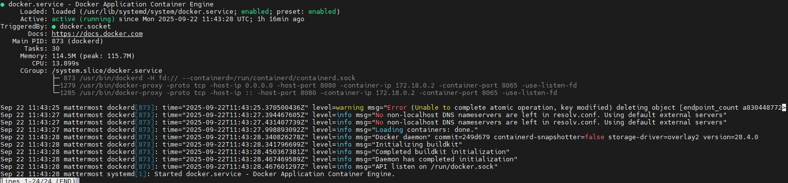

# 🚀 Mattermost Self-hosted Migration on Linux

## 📖 Overview
في المشروع ده عملت Migration لـ **Mattermost server** على **Ubuntu 24.04 LTS** باستخدام **Docker**.  
الغرض من المشروع كان نقل سيرفر التواصل الداخلي للشركة من بيئة قديمة لسيرفر جديد أكثر استقرارًا، مع الحفاظ على نفس الـ IP علشان المستخدمين ميحسوش بأي تغيير.

---

## 🛠️ Environment
- **OS**: Ubuntu 24.04 LTS  
- **Containerization**: Docker + Docker Compose  
- **App**: Mattermost (Team Edition)  

---

## ⚙️ Setup Steps

### 1. Clone the Repository
```bash
cd /home/itadmin/
git clone https://github.com/mattermost/mattermost-docker.git
cd mattermost-docker
```

### 2. Start Services
```bash
docker-compose build
docker-compose up -d
```

### 3. Configure Static IP
```bash
sudo nano /etc/netplan/01-netcfg.yaml
sudo netplan apply
```

### 4. Verify Access
```
http://<server-ip>:8065
```

---

## 🔑 Why Mattermost instead of Slack?
- **Self-hosted** → تحكم كامل في الداتا.  
- **Free & Open Source** → مفيش اشتراك شهري.  
- **Integrations** → بيدعم Git, CI/CD tools, monitoring.  
- **Customizable** → ينفع أعدل عليه بحرية.  

---

## 🛠️ Challenges Solved
- مشكلة رفع الصور (storage permission) → اتظبطت.  
- ظبط السيرفر بنفس الـ IP القديم → علشان المستخدمين ميحسوش بفرق.  
- عملت system update علشان السيرفر يفضل stable.  

---

## 📸 Screenshots



---
